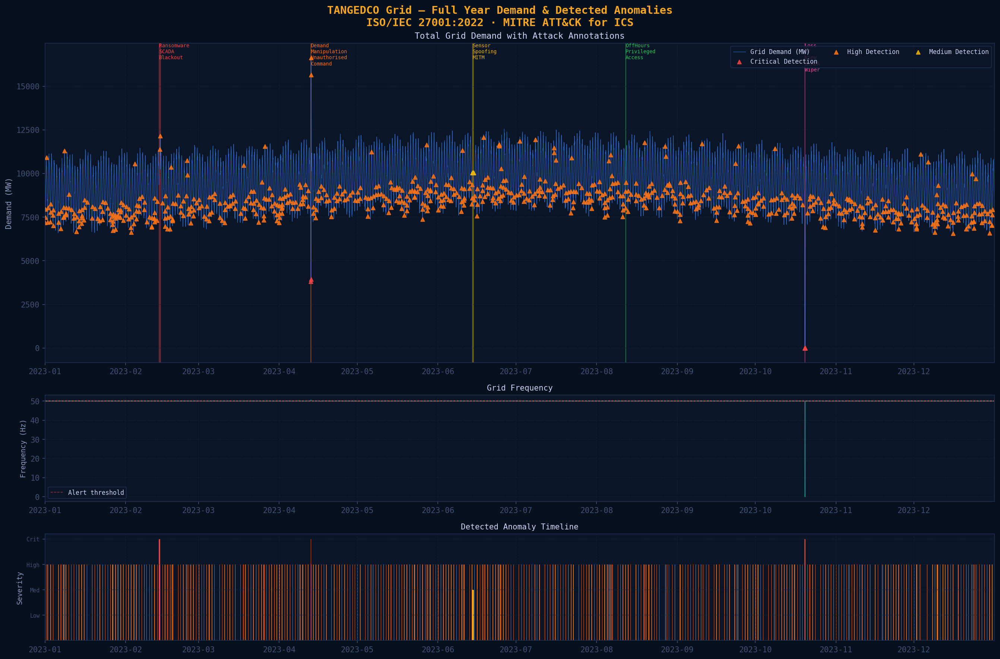
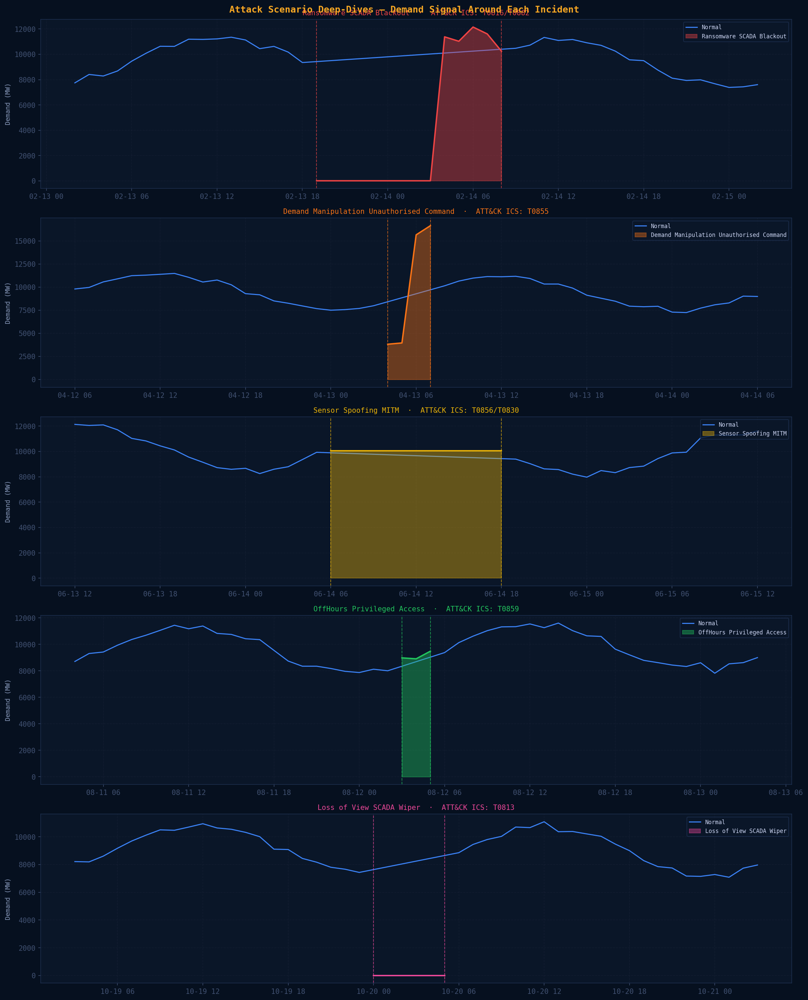
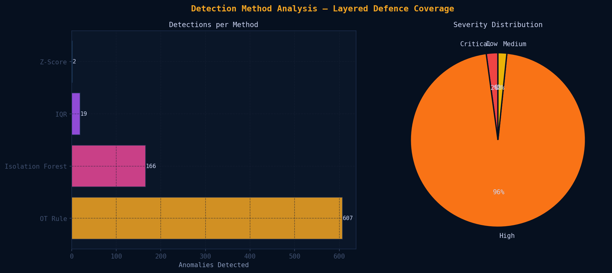
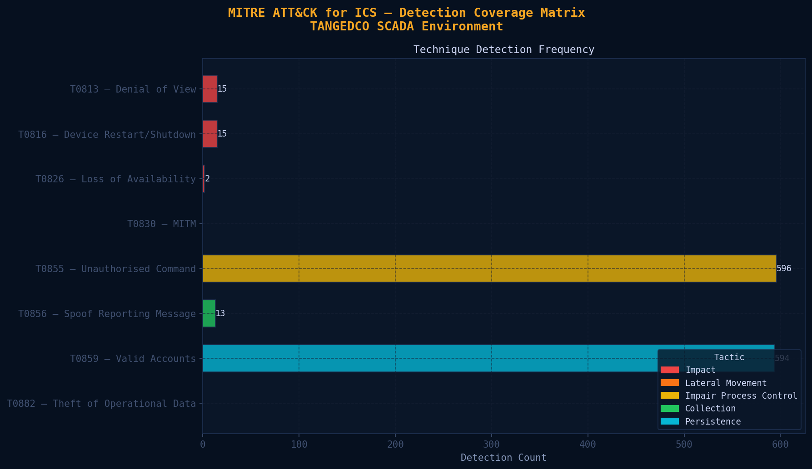

# TANGEDCO OT/ICS Cybersecurity SOC Lab

**Tamil Nadu Generation and Distribution Corporation Limited**  
A full-stack cybersecurity portfolio project covering ICS/OT risk management, anomaly detection, and SOC operations for a real-world critical infrastructure operator.

---

## Project Architecture

```
tangedco-ot-security/
├── anomaly-detection/
│   ├── src/                    ← Python detection engine + SOC integration scripts
│   ├── data/                   ← TANGEDCO grid dataset (8,760 hourly observations)
│   └── output/                 ← Detection results, charts, reports
├── wazuh/
│   ├── rules/tangedco_ics_rules.xml    ← 20 custom Wazuh detection rules
│   └── decoders/tangedco_decoder.xml  ← Custom log decoder
└── docker-compose.yml          ← Full SOC stack deployment
```

---

## Part 1 — ICS Anomaly Detection Tool

### What it does
Detects cyberattack-induced anomalies in electricity grid time-series data using a layered detection approach:

| Method | Description | Detections |
|--------|-------------|------------|
| Z-Score | Rolling 24h window, 3-sigma threshold | 2 |
| IQR | Per-hour conditioned fences | 19 |
| Isolation Forest | Multi-feature ML (demand + frequency + power factor + time) | 166 |
| OT Rule Engine | 6 ICS-specific rules mapped to MITRE ATT&CK for ICS | 607 |

### Detection Results
- **Total observations:** 8,760 hours (365 days)
- **True Positives:** 36/40 attack hours detected
- **Recall: 90%** — high recall intentional for ICS (missing a real attack is worse than a false alarm)
- **Severity breakdown:** 17 Critical, 764 High, 13 Medium

### 5 Attack Scenarios Simulated

| Scenario | ATT&CK ICS Technique | Effect in Data |
|----------|---------------------|----------------|
| Ransomware + SCADA Blackout | T0816, T0882 | Data dropout for 8 hours |
| Demand Manipulation | T0855 | 55% demand drop then 65% spike |
| Sensor Spoofing / MITM | T0856, T0830 | Readings freeze at exact static value |
| Off-Hours Privileged Access | T0859 | Precise 420MW change at 03:00 |
| Loss of View (SCADA Wiper) | T0813 | All readings go to 0 while grid is still running |

### Usage
```bash
pip install -r requirements.txt
python anomaly-detection/src/generate_data.py
python anomaly-detection/src/main.py
python anomaly-detection/src/feed_alerts.py --historical --local
python anomaly-detection/src/thehive_cases.py --dry-run
python anomaly-detection/src/misp_feeds.py --report
```

---

## Part 2 — Full SOC Stack (Wazuh + TheHive + MISP)

### Stack

| Tool | Version | Purpose |
|------|---------|---------|
| Wazuh | 4.7.0 | SIEM with custom ICS detection rules |
| TheHive | 5.2 | Incident management and IR playbooks |
| MISP | Latest | Threat intelligence and IOC management |
| OpenSearch | 2.8 | Data indexing and search |

### Custom Wazuh Rules
20 custom detection rules in ID range 100100-100170 covering:
- SCADA data dropout (T0813, T0816)
- Unauthorised IEC 104/DNP3 commands (T0855)
- Ransomware indicators: VSS deletion, LSASS dump (T1486, T1490)
- Off-hours SCADA access (T0859)
- IT to OT lateral movement (T0886)
- Internet-to-ICS boundary violations (T0866)
- Composite kill-chain correlations (Rules 100170, 100171)

### Deploy
```bash
docker-compose up -d
```

Access points after startup:
- Wazuh Dashboard: https://localhost:443
- TheHive: http://localhost:9000
- MISP: http://localhost:8080

---

## Output Charts






---

## Threat Actor Profiles (MISP)

| Actor | Relevance to TANGEDCO | Key Techniques |
|-------|----------------------|----------------|
| Sandworm Team | HIGH - Industroyer2 targets IEC 104 (same as TANGEDCO EMS) | T0855, T0813, T0816 |
| Volt Typhoon | HIGH - Documented Indian power grid intrusions 2021-2022 | T0859, T0866 |
| TEMP.Veles | MEDIUM - TRITON targets SIS at thermal plants | T0856, T0830, T0839 |
| Dragonfly | MEDIUM - ICS reconnaissance TTPs | T0886, T0859 |

---

## Frameworks and Standards

| Standard | Application |
|----------|------------|
| ISO/IEC 27001:2022 | Risk assessment structure, Annex A control mapping |
| IEC 62443 | OT zone and conduit model, Security Level definitions |
| MITRE ATT&CK for ICS | Attack technique mapping for all anomaly types |
| NIST SP 800-82 Rev. 3 | OT security guidance |
| CEA Cyber Security Guidelines (2023) | India power sector compliance context |

---

## Skills Demonstrated

- **OT/ICS Security** - SCADA threat modelling, IEC 62443 zone architecture, ICS protocol vulnerabilities (Modbus, DNP3, IEC 104)
- **SIEM Engineering** - Custom Wazuh detection rules, ATT&CK technique mapping, detection logic design
- **Anomaly Detection** - Statistical methods (Z-Score, IQR), ML (Isolation Forest), rule-based OT detection
- **Incident Response** - TheHive case management, pre-built IR playbooks per ATT&CK technique
- **Threat Intelligence** - MISP, STIX 2.1 indicators, threat actor profiling
- **GRC** - ISO 27001:2022 risk register, gap analysis, semi-quantitative risk scoring
- **Cloud/DevOps** - Docker, GCP, docker-compose, Linux administration

---

## Data Source

Real historical data: [Kaggle - Tamil Nadu Electricity Board Hourly Readings](https://www.kaggle.com/datasets/pythonafroz/tamilnadu-electricity-board-hourly-readings)

---

*Built for TANGEDCO - Tamil Nadu's state power utility serving 3 crore consumers*  
*ISO/IEC 27001:2022 - IEC 62443 - MITRE ATT&CK for ICS - Wazuh 4.7 - TheHive 5.2 - MISP*
